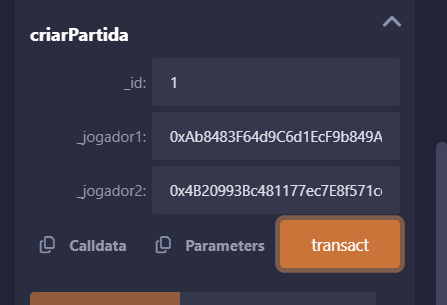
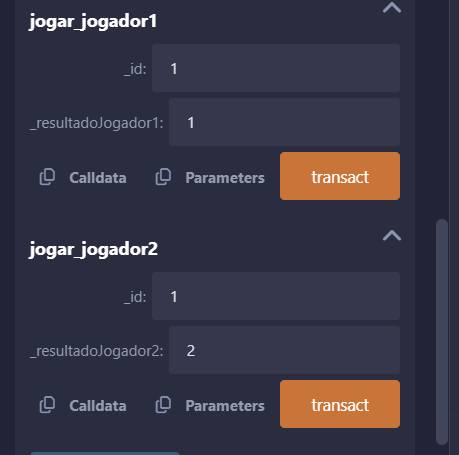
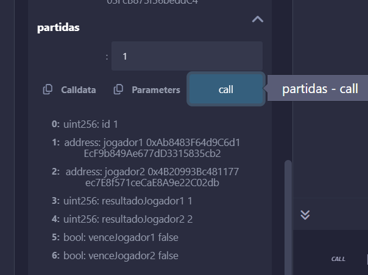

# jokenpo

## Regras de negócio

1. Somente o juiz pode cadastrar novas partidas e jogadores
2. Apenas jogadores cadastrados podem jogar
3. O jogador 1 só pode jogar com o endereço cadastrado como jogador 1
4. O jogador 2 só pode jogar com o endereço cadastrado como jogador 2

## Criar partida e adicionar jogadores: 

## Jogar como jogador 1 e jogador 2

## Consultar uma partida

